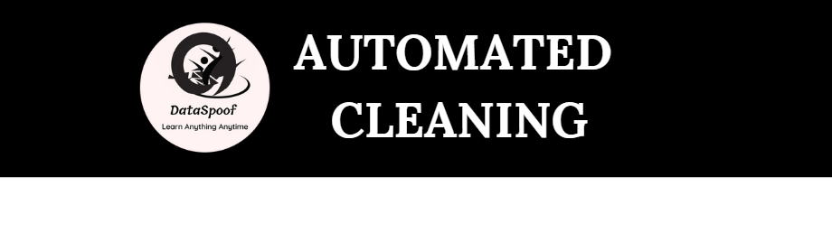

# AutomatedCleaning
[](https://pypi.org/project/AutomatedCleaning/)
[](https://www.linkedin.com/in/abhishek-kumar-singh-8a6326148/)
[](https://www.instagram.com/dataspoof)
[](https://x.com/abhi007si)
[](https://www.youtube.com/@dataspoof1977)


AutomatedCleaning is a Python library for automated data cleaning.It helps preprocess and analyze datasets by handling missing values, outliers, spelling corrections, and more.



## Features
- Supports both large (100+ GB) and small datasets
- Detects and handles missing values and duplicate records
- Identifies and corrects spelling errors in categorical values
- Detect outliers
- Detects and fixes data imbalance
- Identifies and corrects skewness in numerical data
- Checks for correlation and detects multicollinearity
- Analyzes cardinality in categorical columns
- Identifies and cleans text columns
- Detect JSON-type columns
- Performs univariate, bivariate, and multivariate analysis


## Installation
```bash
pip install -q AutomatedCleaning==0.1.3```
```

## Usage
It requires Claude API key which you can get it from here https://console.anthropic.com/settings/keys

```bash
import AutomatedCleaning as ac
df = ac.load_data("dataset.csv")
df_cleaned = ac.clean_data(df)
```
